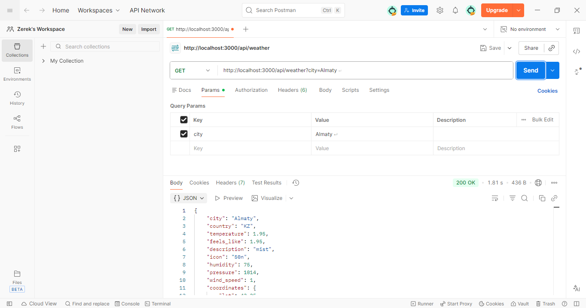
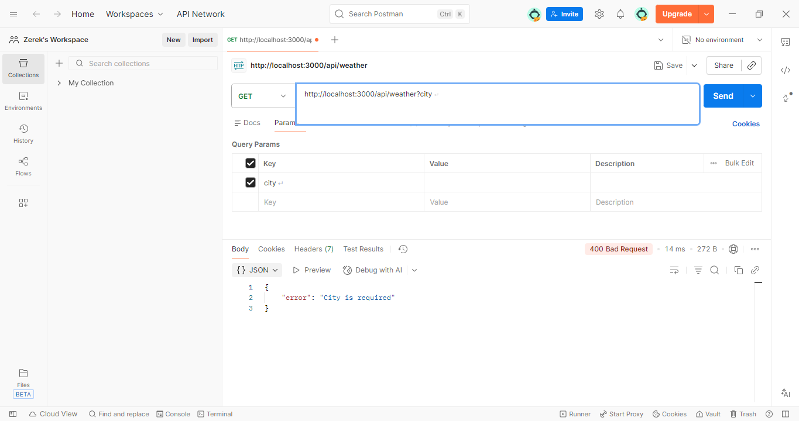
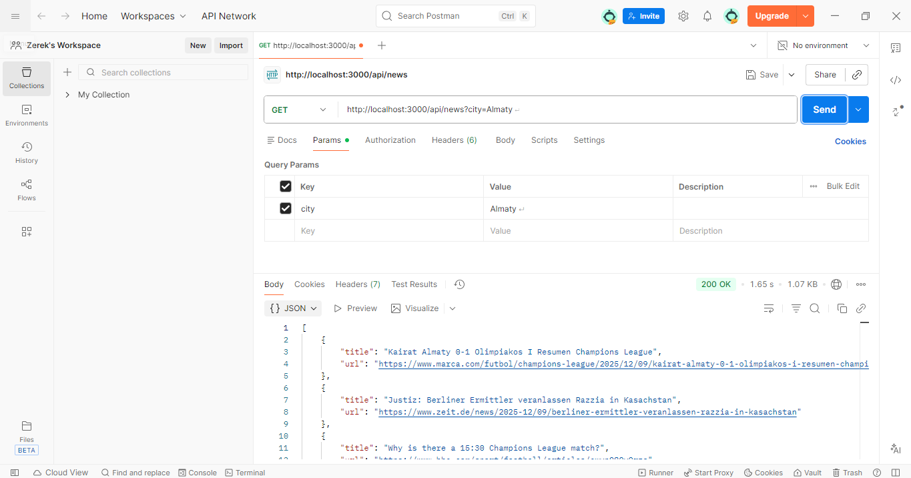
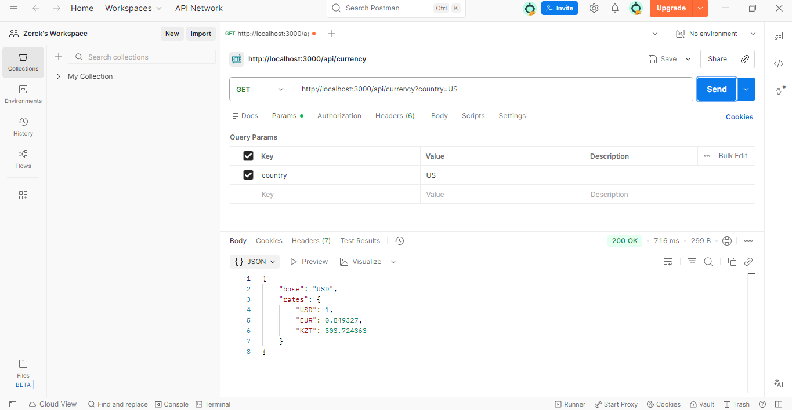

## API Testing with Postman

All backend API endpoints were tested using Postman.  
The following screenshots demonstrate correct API behavior and error handling.

---

### Weather API — 200 OK
**Endpoint:** `GET /api/weather?city=Almaty`

---

### Weather API — 400 Bad Request
**Endpoint:** `GET /api/weather`

---

### News API — 200 OK
**Endpoint:** `GET /api/news?city=Almaty`

---

### Currency API — 200 OK
**Endpoint:** `GET /api/currency?country=KZ`

